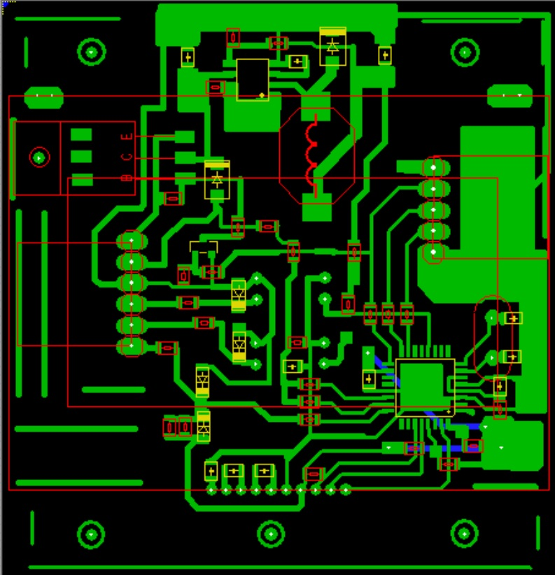
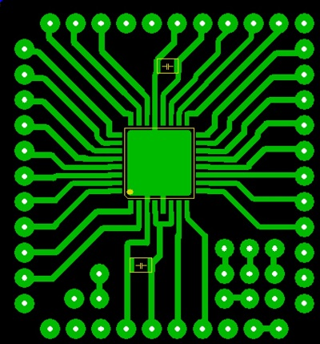
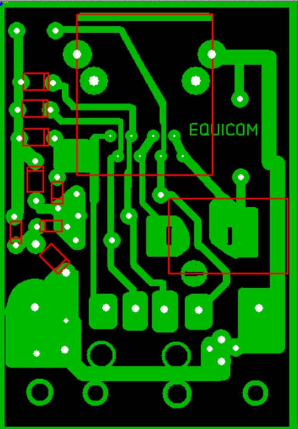
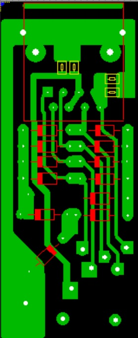

<h2>Подборка печатных плат.</h2>

Разводка отладочной платы для atmega8. Используется стабилизатор питания mc34063 и любой внешний блок питания от 7 до 15 вольт. 
Сделана маска со стороны штекеров. Можно распечатать и перевести на текстолит. 
100x50mm 
 
<a href="./Boards/Atmega8DebugBoard/KatsModerBoard.zip">Разводка</a>

Печатная плата дисплея RDX0154GC. Питание mc34063, микроконтроллер armega88. 
67x70mm 
 
<a href="./Boards/DisplayRDX0154GC/RDX0154GC.zip">Разводка</a>

 Монтажная плата для Atmega8/48/88/168 в корпусеTQFP. 
 32x32mm 
 
<a href="./Boards/MontagkaMega8/montagka_mega_48.zip">Разводка</a>

Печатная плата инжектора PoE c грозозащитной v1. 
Плата помещается в телефонную коробку.
Было собрано более 20 устройств. Диоды 1n4007 (лучше использовать быстродействующие). Двухсторонний саппресор на 6,8 вольт. Разрядник 90вольт. Наличие настоящего заземления обязательно. 
35x51mm 
 
<a href="./Boards/GrozaV1/Groza.zip">Разводка</a>

Печатная плата инжектора PoE c грозозащитной v2. 
 
<a href="./Boards/GrozaV2/GrozaV2.zip">Разводка</a>

